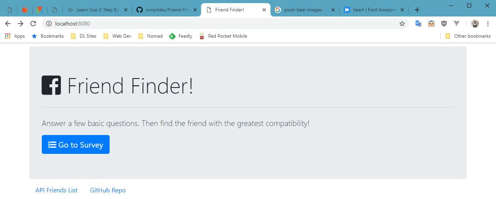
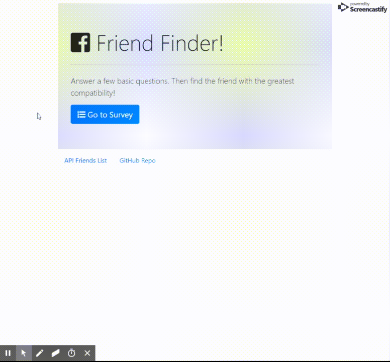
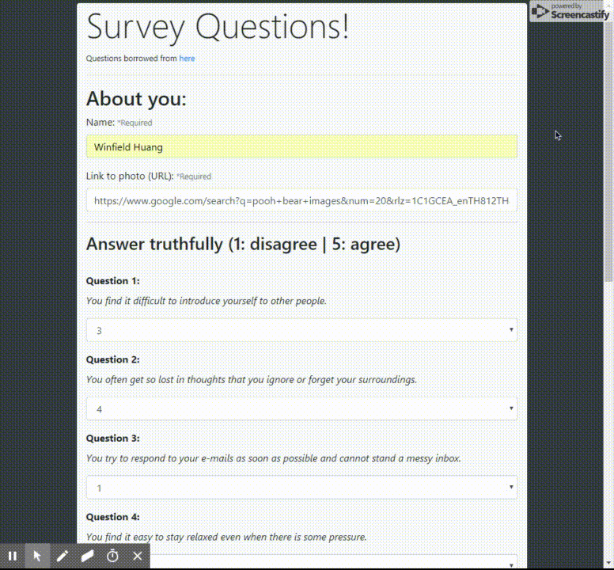

# Friend-Finder
A compatibility-based "FriendFinder" application -- basically a dating app. This full-stack site will take in results from your users' surveys, then compare their answers with those from other users. The app will then display the name and picture of the user with the best overall match.

## Home page
This is where it shows information about the site and has a button to take you to a separate survey page.

## Survey page
Here is the simple form where the user inputs their name and a web URL link of their picture. Then they would fill out the questionaire and submit.

## Your closest match
After the form is submitted, a score is calculated and the person with the closest score is shown in a pop-up screen.

